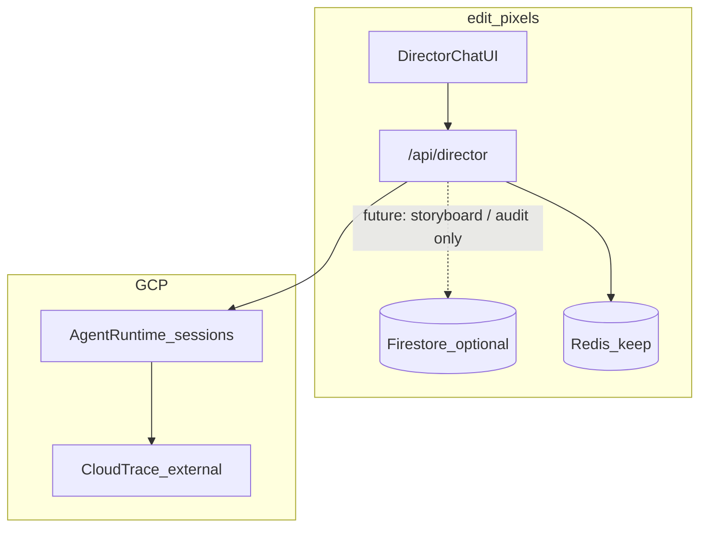

# ADR 001: Director Persistence — No Firestore (Deferred)

**Status:** Superseded by [ADR 002](./002-director-firestore-persistence.md)  
**Date:** 2026-08-30  
**Scope:** Creative Director (`/api/director`), billing, and product persistence in edit-pixels

> **Note:** Firestore was implemented on 2026-08-30. See ADR 002 for the active architecture. This document is kept for historical context.

---

## Context

Creative Director is a paid chat proxy from the editor UI to a Vertex Agent Engine reasoning engine. The app streams SSE responses, verifies CRTVAI on-chain payments, and renders tool calls in the AI sidebar. Projects and media remain **local-first** (workspace File System Access API + OPFS).

The question: should edit-pixels add **Firestore** for Director sessions, storyboards, or billing?

---

## Current state (as of this ADR)

| Need | Current solution | Key files |
|------|------------------|-----------|
| Agent conversation memory | Vertex Agent Engine `session_id` round-trip | [`api/director.ts`](../../api/director.ts), [`src/features/editor/director/director-store.ts`](../../src/features/editor/director/director-store.ts) |
| Director chat in UI | Zustand store (in-memory; lost on refresh) | [`director-store.ts`](../../src/features/editor/director/director-store.ts) |
| Payment anti-replay | Redis SET NX, **14-day TTL** | [`api/_payment-ledger.ts`](../../api/_payment-ledger.ts), [`api/director-billing.ts`](../../api/director-billing.ts) |
| Generative task ownership | Redis, **24h TTL** (Flow/Veo only — not Director) | [`api/_task-registry.ts`](../../api/_task-registry.ts) |
| Project / media bytes | Local workspace FS + OPFS | [`src/infrastructure/storage/workspace-fs/`](../../src/infrastructure/storage/workspace-fs/) |
| Firestore | **Not present** (no SDK, no references) | — |

**Engine defaults** (overridable via env):

- Project: `creative-ai-491118` (`GOOGLE_CLOUD_PROJECT` / `GCP_PROJECT_ID`)
- Region: **`us-east1`** (`VERTEX_LOCATION`)
- Engine ID: `7129954674127405056` (`VERTEX_REASONING_ENGINE_ID`)

Documented in [`api/director.ts`](../../api/director.ts) and [`api/_vertex-auth.ts`](../../api/_vertex-auth.ts).

**Director request flow:**

1. User submits prompt (+ optional timeline audio URI, CRTVAI payment tx) from [`director-chat-panel.tsx`](../../src/features/editor/director/director-chat-panel.tsx).
2. [`director-store.ts`](../../src/features/editor/director/director-store.ts) POSTs to `POST /api/director`.
3. [`api/director.ts`](../../api/director.ts) verifies billing via Redis, proxies `async_stream_query` to Agent Engine SSE.
4. Client parses ADK events ([`parse-sse.ts`](../../src/features/editor/director/parse-sse.ts)) and updates Zustand (messages, tool calls, `sessionId`).

The Zustand store is explicitly **display-only** — it does not mutate the timeline.

---

## Decision

**Do not add Firestore for the Creative Director agent runtime or its operational guards.**

Keep the existing layer boundaries:

| Layer | Role |
|-------|------|
| **Agent Engine** | Source of truth for multi-turn agent context (`session_id`) |
| **Redis / Vercel KV** | Ephemeral idempotency: payment anti-replay, Flow task ownership |
| **Zustand (`director-store`)** | Live UI chat state for the current browser session |
| **Workspace FS** | Durable project and media data on the user's machine |

Firestore would **not** replace Agent Engine sessions, Redis payment guards, or local project storage. It would only store the **app's view** of Director output (metadata, saved storyboards, billing receipts) if and when product features require durable, user-scoped history.

---

## Architecture



---

## What Firestore is **not** for

- **Agent conversation memory** — Agent Engine owns session state; duplicating it in Firestore adds sync risk with no runtime benefit.
- **Payment anti-replay** — Redis SET NX with TTL is the right primitive; Firestore lacks atomic consume semantics for this pattern.
- **Generative task registry** — Flow/Veo task binding stays in Redis ([`_task-registry.ts`](../../api/_task-registry.ts)).
- **Caching agent responses** — latency-sensitive; Agent Engine is live SSE.
- **Full SSE stream archival** — large payloads; GCS is a better fit if needed.
- **Project media bytes** — local-first by design ([`workspace-fs/paths.ts`](../../src/infrastructure/storage/workspace-fs/paths.ts)).

---

## When to revisit Firestore (future triggers)

Add Firestore **only** when one of these product features is prioritized:

1. **Past Director briefs UI** — session index so users can reopen briefs after refresh or on another device. Agent Engine keeps conversation; Firestore keeps pointer + metadata.
2. **Storyboard → timeline clip generation** — durable structured output tied to `projectId` and `agentSessionId`.
3. **Billing audit beyond Redis TTL** — append-only payment records for support/disputes after the 14-day Redis window.

**Prerequisite before any Firestore work:** validate Director ↔ Agent Engine wiring in the target environment (`VERTEX_LOCATION`, `VERTEX_REASONING_ENGINE_ID`, WIF/ADC auth).

---

## Future schema sketch (non-binding)

If Firestore is added later, keep collections minimal:

```
director_sessions/{sessionId}
  userId, projectId, engineId, audioUri, createdAt, status

director_storyboards/{id}
  sessionId, projectId, markdown, scenes[], createdAt

director_payments/{txHash}
  wallet, quote, audioSeconds, sessionId, createdAt
```

**Security rules:** keyed on Privy user ID and/or linked wallet address. Never store GCP credentials or raw payment secrets in Firestore.

---

## Consequences

**Accepted trade-offs today:**

- Refreshing the page or calling `clearChat()` loses chat history unless the user still holds a valid Agent Engine `sessionId` and can continue the same session manually (no session picker UI exists).
- No cross-device Director brief history.
- Payment tx metadata in Redis expires after **14 days** — no durable in-app audit trail for disputes.
- Director output is not applied to the timeline automatically; storyboards exist only as chat text/tool output in memory.

**Benefits:**

- No duplicate state between Agent Engine and a document store.
- Redis remains optimal for TTL-based idempotency.
- Local-first project model stays unchanged.
- Zero Firestore infra cost and complexity while Director product scope is still chat-proxy + billing.

---

## Related docs

- [`docs/agent-prompt.md`](../agent-prompt.md) — headless MCP agent workflow (separate from Director UI)
- [`api/director.ts`](../../api/director.ts) — Director SSE proxy implementation
