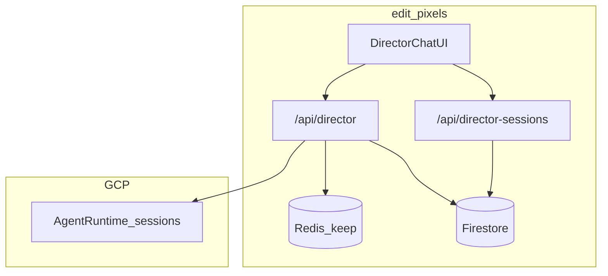

# ADR 002: Director Firestore Product Persistence

**Status:** Accepted  
**Date:** 2026-08-30  
**Supersedes:** [ADR 001](./001-director-persistence-no-firestore.md) (deferral decision)  
**Scope:** Creative Director metadata, storyboards, and billing audit in edit-pixels

---

## Context

ADR 001 deferred Firestore until product features needed durable Director output. Those features are now implemented:

- Session index for **past briefs** in the Director UI
- **Storyboard** markdown archive after completed streams
- **Billing audit** records beyond the 14-day Redis anti-replay TTL

Agent Engine remains the source of truth for multi-turn conversation memory. Redis remains the payment anti-replay guard.

---

## Decision

Add Firestore as **optional product persistence** written from Vercel API routes only:

| Collection | Purpose | Writer |
|------------|---------|--------|
| `director_sessions/{sessionId}` | Session metadata index | `POST /api/director` |
| `director_storyboards/{autoId}` | Completed assistant markdown + scene chunks | `POST /api/director` (stream end) |
| `director_payments/{txHash}` | Durable billing audit | `POST /api/director` (after Redis consume) |

Reader: `GET /api/director-sessions?wallet=0x…&projectId=…`

---

## Architecture

---

## Implementation

| File | Role |
|------|------|
| [`api/_firestore-client.ts`](../../api/_firestore-client.ts) | Lazy Firestore client (WIF / ADC via `_vertex-auth`) |
| [`api/_director-firestore.ts`](../../api/_director-firestore.ts) | Session, storyboard, payment writes + list query |
| [`api/_director-sse-persist.ts`](../../api/_director-sse-persist.ts) | SSE tee parser for session id + assistant text |
| [`api/director.ts`](../../api/director.ts) | Persists on stream; still proxies SSE unchanged to client |
| [`api/director-sessions.ts`](../../api/director-sessions.ts) | Past briefs index |
| [`firestore.rules`](../../firestore.rules) | Client deny-write; wallet-scoped read if Firebase Auth added later |
| [`src/features/editor/director/director-past-briefs.tsx`](../../src/features/editor/director/director-past-briefs.tsx) | Past briefs UI |

---

## Environment

Uses the same GCP project and WIF/ADC credentials as Vertex:

- `GOOGLE_CLOUD_PROJECT` / `GCP_PROJECT_ID` (default `creative-ai-491118`)
- `FIRESTORE_DATABASE_ID` (default **`creative-director-1`** — the named DB in Firestore Studio)
- WIF vars on Vercel (see [`api/_vertex-auth.ts`](../../api/_vertex-auth.ts))
- `DIRECTOR_FIRESTORE_DISABLED=1` — opt out without removing code

**edit-pixels uses the native `@google-cloud/firestore` SDK**, not the MongoDB compatibility connection strings shown in Firestore Studio. Those SCRAM/OIDC URLs are for MongoDB tools (Compass, Studio MQL) only.

**Firestore setup (GCP console):**

1. Database **`creative-director-1`** is already created (Firestore Studio / `nam5`).
2. Grant the Vertex/WIF service account `roles/datastore.user` on that database.
3. Create composite index on **`director_sessions`**: `wallet` ASC, `updatedAt` DESC (Firestore suggests this on first list query).
4. Deploy [`firestore.rules`](../../firestore.rules) if exposing client SDK later.

---

## Consequences

- Past briefs list shows metadata only; resuming sets `sessionId` for the next Agent Engine turn (conversation body stays in Agent Engine).
- Storyboards are saved when a stream completes with ≥50 chars of assistant text.
- Payment records are append-only audit; Redis still enforces one-time tx consumption.
- Local dev without ADC/Firestore: persistence no-ops; Director chat still works.

---

## Related

- [ADR 001 — original deferral rationale](./001-director-persistence-no-firestore.md)
