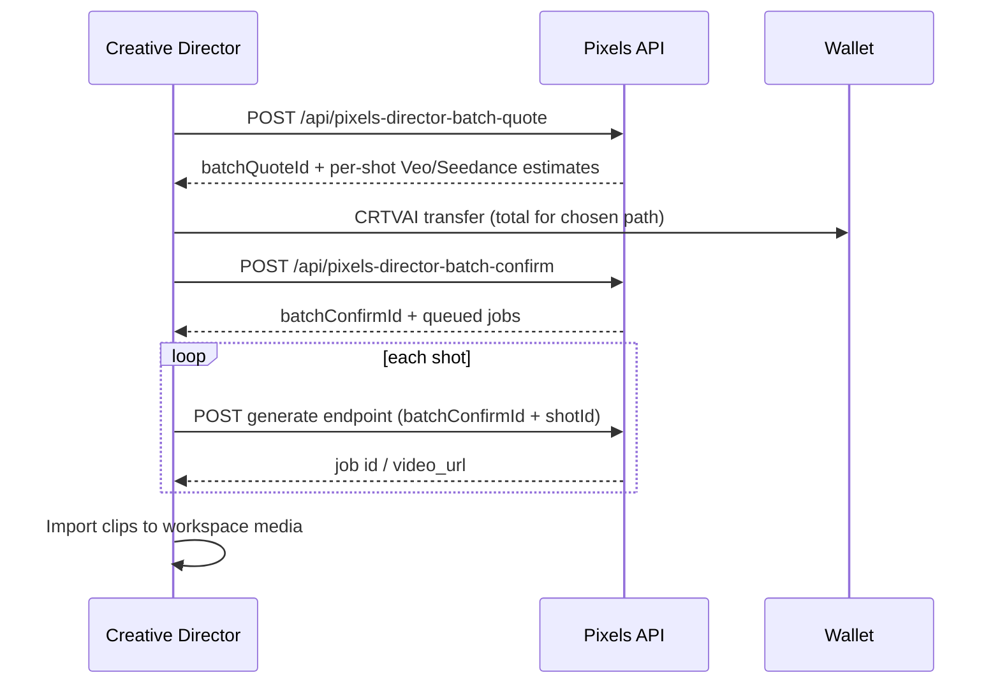

# Creative Director ↔ Pixels Generate bridge (Phase 2)

Depends on [Phase 1 generate hardening](./seedance-generate.md) (`agent/seedance-phase1-harden-2096` / PR #97).

Director production mode must not invent mock video URLs. Each storyboard shot uses the same Pixels quote/render APIs as the editor Generate tab. **Never auto-spend** — batch quote first, user/G2 confirms, then per-shot generates enqueue.

Phase 2 exit: confirmed batch → N real clips in workspace media (not auto-timeline — Phase 4).

## Feature flag

Same as Phase 1:

| Variable | Where |
|----------|-------|
| `VITE_ENABLE_SEEDANCE_GENERATE` | Client |
| `SEEDANCE_GENERATE_ENABLED` | Server |

## Flow



## Shot → provider mapping

| Input | Provider |
|-------|----------|
| `consistentCharacter: true` | **Seedance** (character consistency) |
| `providerPreference` set | User preference (`veo` \| `seedance`) |
| Otherwise | **Veo** |

Mapping helpers live in `api/_director-generate-map.ts`.

## POST `/api/pixels-director-batch-quote`

Auth: Privy bearer + `walletAddress`. **No spend.**

### Request

```json
{
  "walletAddress": "0x…",
  "token": "<privy-access-token>",
  "storyboardId": "optional-session-id",
  "providerPreference": "veo",
  "resolution": "720p",
  "shots": [
    {
      "shotId": "shot-1",
      "prompt": "Wide city skyline at dusk, cinematic",
      "duration": 5,
      "aspectRatio": "16:9",
      "consistentCharacter": false
    },
    {
      "shotId": "shot-2",
      "prompt": "Same hero close-up in rain",
      "duration": 6,
      "aspectRatio": "9:16",
      "consistentCharacter": true
    }
  ]
}
```

Snake_case aliases accepted: `aspect_ratio`, `consistent_character`, `provider_preference`, `storyboard_id`.

### Response

```json
{
  "batchQuoteId": "uuid",
  "expiresAt": "2026-09-19T01:00:00.000Z",
  "shotCount": 2,
  "shots": [
    {
      "shotId": "shot-1",
      "recommendedProvider": "veo",
      "generate": {
        "prompt": "…",
        "duration": 5,
        "veoDuration": 6,
        "seedanceDuration": 5,
        "aspect_ratio": "16:9",
        "resolution": "720p"
      },
      "veo": { "provider": "veo", "crtvaiRequired": "…", "formattedUsd": "$0.50", … },
      "seedance": { "provider": "seedance", "quoteId": "uuid", "crtvaiRequired": "…", … }
    }
  ],
  "totals": {
    "allVeo": { "crtvaiRequired": "…", "formattedUsd": "$1.00", … },
    "allSeedance": { "crtvaiRequired": "…", "formattedUsd": "$1.20", … },
    "recommendedMix": {
      "crtvaiRequired": "…",
      "formattedUsd": "$1.10",
      "providers": { "veo": 1, "seedance": 1 }
    }
  }
}
```

Quotes persist ~15 minutes (Redis). Seedance per-shot `quoteId` values are consumed on generate.

## POST `/api/pixels-director-batch-confirm`

Binds quote + payment. Returns job descriptors for enqueue. **Still requires wallet pay flow** when billing enforced.

### Request

```json
{
  "walletAddress": "0x…",
  "token": "<privy-access-token>",
  "batchQuoteId": "uuid-from-quote",
  "paymentTxHash": "0x…",
  "selections": [
    { "shotId": "shot-1", "provider": "veo", "requestId": "client-uuid-1" },
    { "shotId": "shot-2", "provider": "seedance", "requestId": "client-uuid-2" }
  ]
}
```

- `paymentTxHash` required when treasury billing enforced (sum ≥ selected path total).
- `DIRECTOR_BILLING_SOFT=1`: balance gate only (same as Phase 1).
- One `requestId` per shot (client-generated UUID).
- Each quoted `shotId` must appear exactly once in `selections` (bijection).
- `batchQuoteId` is consumed on first successful confirm; reuse returns `quote_already_confirmed`.

### Response

```json
{
  "batchConfirmId": "uuid",
  "batchQuoteId": "uuid",
  "paymentTxHash": "0x…",
  "totalCrtvaiRequired": "…",
  "totalCrtvaiDisplay": 1.1,
  "jobs": [
    {
      "shotId": "shot-1",
      "requestId": "client-uuid-1",
      "provider": "veo",
      "status": "queued",
      "seedanceQuoteId": null,
      "crtvaiRequired": "…",
      "pollUrl": "/api/pixels-generate-task?id=client-uuid-1",
      "generateEndpoint": "/api/pixels-render-veo"
    }
  ],
  "enqueue": {
    "batchConfirmId": "uuid",
    "note": "Call generateEndpoint per job with batchConfirmId + shotId + requestId. Do not send paymentTxHash on per-shot calls."
  }
}
```

## Per-shot generate (enqueue)

**Claim timing:** Each generate validates wallet + batch binding first, runs quote/billing pre-flight, then takes an atomic per-shot claim (`SETNX` on `batchConfirmId` + `shotId`). If provider enqueue fails, the claim is released so the shot can be retried. A second concurrent POST for the same shot receives `batch_shot_already_started` (409).

After confirm, call the listed `generateEndpoint` for each job:

### Veo

`POST /api/pixels-render-veo`

```json
{
  "walletAddress": "0x…",
  "token": "…",
  "batchConfirmId": "uuid",
  "shotId": "shot-1",
  "requestId": "client-uuid-1"
}
```

### Seedance

`POST /api/seedance-generate`

```json
{
  "walletAddress": "0x…",
  "token": "…",
  "batchConfirmId": "uuid",
  "shotId": "shot-2",
  "requestId": "client-uuid-2"
}
```

Prompt/duration/aspect/quote binding come from the batch confirm record. Poll `GET /api/pixels-generate-task?id=` (Seedance) or `GET /api/generate-task?id=` (Veo `veoTaskId` from job record).

Import completed `video_url` into workspace media — **do not** auto-place on timeline (Phase 4).

## Client helpers

`src/features/editor/seedance/seedance-client.ts`:

- `quoteDirectorBatch(auth, { shots, providerPreference })`
- `confirmDirectorBatch(auth, { batchQuoteId, selections, paymentTxHash })`

## Staging smoke env

| Variable | Purpose |
|----------|---------|
| `SEEDANCE_GENERATE_ENABLED=1` | Enable APIs |
| `VITE_ENABLE_SEEDANCE_GENERATE=1` | Editor smoke UI |
| `HIGGSFIELD_KEY_ID` + `HIGGSFIELD_KEY_SECRET` | Seedance |
| Vertex / GCP vars | Veo |
| Upstash KV | Quotes + batch records + jobs |
| `VITE_SUPERFLUID_RECEIVER` | CRTVAI treasury |
| `HIGGSFIELD_MOCK=1` | Optional mock MP4 |
| `DIRECTOR_BILLING_SOFT=1` | Optional soft billing |

## Phase 3 — Batch render UI

See [director-batch-render-ui.md](./director-batch-render-ui.md) for the Director tab **Render all shots** flow, progress UI, retry-failed-only, and provider-specific enqueue caps (Seedance/Higgsfield default **20**; Veo uncapped).

## Out of scope (Phase 2)

- Auto-timeline placement (Phase 4)
- HF keys in browser or Director agent process
